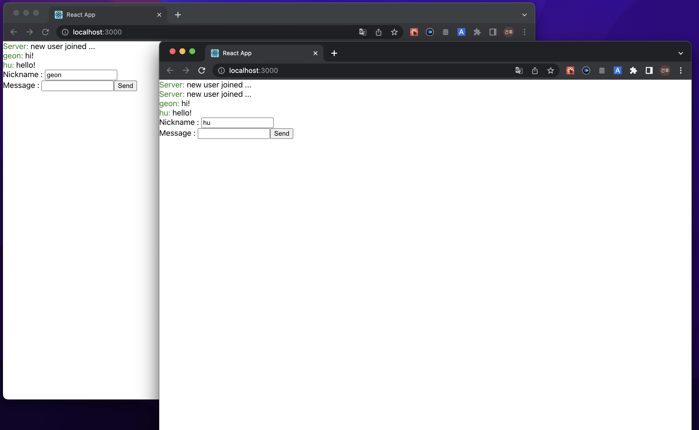

# Chat application using gRPC, React



## How to use?

### Docker

```undefined
docker build -t parkgeonhu/envoy .
```

```undefined
docker run -d -p 9090:9090 parkgeonhu/envoy
```

### gRPC sever

```
node server.js
```

### react-app

```
yarn install
yarn start
```


## Structure

**프로토콜 버퍼**(Protocol Buffers)는 구조화된 데이터를 [직렬화](https://ko.wikipedia.org/wiki/직렬화)하는 방식이다. 유선이나 데이터 저장을 목적으로 서로 통신할 프로그램을 개발할 때 유용하다. proto파일을 grpc-web용으로 컴파일한 뒤, 아래와 같이 불러온다. 이것으로 서버에 연결하고, 스키마를 불러온다.

```javascript
    const { ChatClient } = require('../protos/chat_grpc_web_pb');
    const { Message } = require('../protos/chat_pb.js');

    var client= new ChatClient('http://localhost:9090', null, null);
```

grpc-web 기준으로, 프로토파일을 컴파일 하는 명령어는 다음과 같다. 이 과정을 거치면, proto 파일명을 가진 `[proto file name]_grpc_web_pb.js`, `[proto file name]_pb.js` 두 개의 파일이 생성될 것이다.

```protobuf
syntax = "proto3"; //Specify proto3 version.

package example; //Optional: unique package name.

service Chat { //Service class to be used by the clients
    rpc join(Message) returns (stream Message){}
    rpc send(Message) returns (Message){}
}

message Message { //Information that will be passed between client and service
    string user = 1;
    string text = 2;
}
```

```bash
protoc -I=. [protofile] --js_out=import_style=commonjs:. --grpc-web_out=import_style=commonjs,mode=grpcwebtext:.
```

react hook 중 하나인 useEffect를 이용해 컴포넌트가 마운트 될 때 stream 객체에 이벤트리스너를 붙여준다. `stream.on('data')` 는 스트림객체에서 데이터를 받을 때마다 두번째 인자로 콜백함수를 실행시킨다.

```javascript
    useEffect(() => {
        let streamRequest = new Message();
        streamRequest.setUser("user");

        var stream = client.join(
            streamRequest,
            null
        );

        stream.on('data', function(response) {
            console.log(response);
            setChat(c => [...c, { name : response.array[0], msg : response.array[1] }]);
        });

        return () => {
        };

    },[]);
```

메시지를 보낼 때는 proto파일에서 만들었던 스키마를 불러와서, 객체를 만들어준다. 그 뒤로, set을 통하여 그 객체에 정보를 담는다. 아래의 코드와 같다.

```javascript
        const request = new Message();
        request.setText(msg);
        request.setUser(name);
        client.send(request, {}, (err, response) => {
            if (response == null) {
              console.log(err)
            }else {
              console.log(response)
            }
        });
```

https://github.com/grpc/grpc-web/issues/347

gRPC web-client won’t send HTTP2 requests. Instead, you need a proxy between your web-client and gRPC backend service for converting that HTTP1 request to HTTP2. gRPC web client has built-in support for Envoy as a proxy. You can find more information about this [here](https://grpc.io/blog/state-of-grpc-web#f2).

gRPC web-client는 http2 request를 보내지 않는다. 대신 proxy를 web-client와 gRPC 백엔드 서버 사이에 둠으로써 http1 요청을 http2 요청으로 변환한다. gRPC web-client는 Envoy를 프록시로서 기본적으로 지원한다. 따라서 아래의 명령어대로 DockerFile을 build하고 run 한다.

```
docker build -t parkgeonhu/envoy .
```

```
docker run -d -p 9090:9090 parkgeonhu/envoy
```

다음은 node.js 기반 gRPC 백엔드 서버 코드다. 이것은 `node server.js`로 실행시켜주도록 한다. 이제 클라이언트에서 메시지를 보내면 envoy proxy server를 거쳐서 이 서버로 넘어오게 될 것이다. 서버로 넘어오게 되면, ServerWritableStream 이 넘어온다. 이것을 이용해 server side streaming이 가능하다. notifyChat 함수를 보면 `user.write` 를 통해 메시지를 전달하고 있다.

```javascript
let grpc = require("grpc");
var protoLoader = require("@grpc/proto-loader");
 
const server = new grpc.Server();
const SERVER_ADDRESS = "localhost:8080";
 
// Load protobuf
let proto = grpc.loadPackageDefinition(
  protoLoader.loadSync("src/protos/chat.proto", {
    keepCase: true,
    longs: String,
    enums: String,
    defaults: true,
    oneofs: true
  })
);
 
let users = [];
 
// Receive message from client joining
function join(call, callback) {
  console.log(call)
  users.push(call);
  notifyChat({ user: "Server", text: "new user joined ..." });
}
 
// Receive message from client
function send(call, callback) {
  console.log(call.request);
  
  notifyChat(call.request);
  console.log(callback)
  return callback(null,{text:call.request.text})
}
 
// Send message to all connected clients
function notifyChat(message) {
  users.forEach(user => {
    user.write(message);
  });
}
 
// Define server with the methods and start it
server.addService(proto.example.Chat.service, { join: join, send: send });
 
server.bind(SERVER_ADDRESS, grpc.ServerCredentials.createInsecure());

console.log("Start Server!");

server.start();
```
